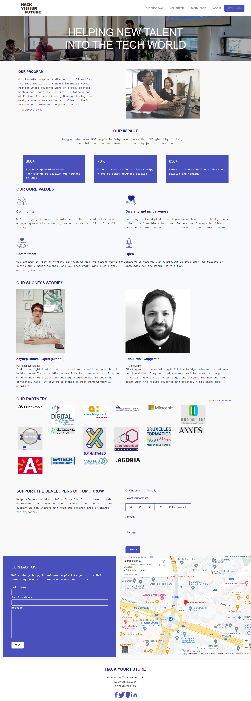

# Hack Your Future website

The Hack Your Future project involves to train people with a refugee background
to become web developers and software testers through a free training. After the
education, graduates start their careers. Hack Your Future believe coding can
help people in disadvantaged situations live up to their potential, get back
control of their own lives and be an important change to their environment.

## Table of contents

- [Hack Your Future website](#hack-your-future-website)
  - [Table of contents](#table-of-contents)
  - [General info](#general-info)
  - [Screenshots](#screenshots)
  - [Technologies](#technologies)
  - [Setup](#setup)
  - [Status](#status)
  - [Contact](#contact)

## General info

Hack Your Future mission is to provide them training, hence, the necessary
skills to pace their job search in the light of the market demand.

## Screenshots

## Technologies

- Npm
- VSC code
- HTML 5
- CSS

## Setup

- Clone repo
- Npm install

## Status

Project is: _Done_

## Contact

| Name                                                 |
| ---------------------------------------------------- |
| [Ervin Mamutov](https://github.com/ervinMamutov)     |
| [Himanshi Saxena](https://github.com/himanshisaxena) |
| [Komal](https://github.com/komal-89)                 |
| [Rahwa Kinfe](https://github.com/Rahwakinfe)         |
