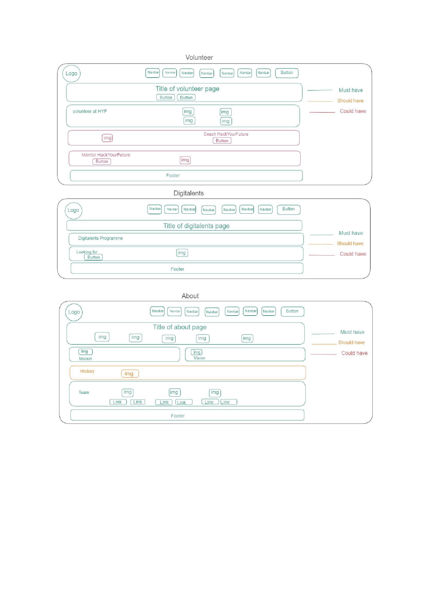
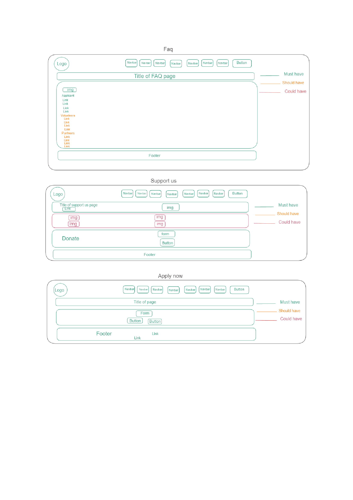

# Hack Your Future rebuild project

---

## User Story Dependencies

[Story Dependency Diagram](user-personas.md)

---

## WIREFRAME

## Setup

- create a new repo form the template `template-html-css`
- add collaborators
- turn on github pages and give them `write` access
- protect `main` branch
- turn on discussion

---

## 1. Home page

### Logo

- As a user I can see the logo of the website.

- The website needs logo.

- This feature developed on a branch logo.

#### HTML

- Add img tag

#### css

- Add logo class to img

### Navigation bar

- As a user I can see the navigation bar of the website.
- The website needs navigation bar.
- This feature developed on a branch navigation-bar.

#### HTML

- add nav tag

#### css

- Add navigation class to logo

### Tag line with image

- As a user I can see the Tag line with image of the website.
- This feature developed on a branch Tag line with image.

#### HTML

- Add div tag
- Add img tag
- Add h1 tag

#### CSS

- Add Tag line with image class to section

### The description of the program

- As a user I can see the description of the program on the website.
- This feature developed on a branch description.

#### HTML

- Add div tag
- Add h2 tag
- Add button tag
- Add img tag

#### CSS

- Add description class to div

### The statistic of the program

- As a user I can see the statistic of the program on the website.
- This feature developed on a branch statistic.

#### HTML

- Add div tag
- Add h2 tag
- Add h1 tag
- Add p tag

#### CSS

Add statistic class to div

### Partners

- As a user I can see the partners of the project on the website.
- This feature developed on a branch partners.

#### HTML

- Add div tag
- Add h2 tag
- Add img tag

#### CSS

- Add partners class to div

### Support developers

- As a user I can support the developers of the project on the website.
- This feature developed on a branch donate.

#### HTML

- Add div tag
- Add h1 tag
- Add p tag
- Add form tag
- Add li tag
- Add label tag
- Add input tag
- Add button tag

#### CSS

- Add description class to div
- Add donate class to form

### Contact

- As a user I can contact with administration of the project on the website.
- This feature developed on a branch contacts.

#### HTML

\_ Add div tag

- Add h1 tag
- Add p tag
- Add label tag
- Add input tag
- Add button tag

#### CSS

- Add contact class to div

### Footer

- As a user I can see the footer of the website.
- This feature developed on a branch footer.

#### HTML

- Add div tag
- Add h3 tag
- Add p tag
- Add a tag
- Add img tag

#### CSS

- Add footer class to div
- Add social-media class to div

## 2. The program

### Logo

- As a user I want to see the logo in the left-top side of the page

#### HTML

- Add img tag for the logo

#### CSS

- Assign class logo to theimg`

### Navigation bar

- As an user I can navigate through eight elements.
- There's a navigation bar on the right of the logo

#### HTML

- Add ul, li, a for the navigation bar

#### CSS

- Add class navbar, to the navigation bar container

### Title

- As an user I can find the title

#### HTML

- Add h1 for the title

#### CSS

- Add class title

### Description

- As an user I can easily tell what the page is about

#### HTML

- Add p describing the objective of the page
- Add img
- Add button to apply for the course

### Curriculum section

- As an user I want to see the breakdown of the program

#### HTML

- Add button to view the curriculum
- Add button to become a coach
- Add img

#### CSS

- Add class curriculum
- Add class become-a-coach

### Final project section

- As an user I want to know what the final project is about

#### HTML

- Add p for the final project description
- Add a for a more information link
- Add img

#### CSS

- Add class finalProject-img

### Mentorship program

- As an user I want to read more information to become a mentor

#### HTML

- Add p for the mentorship program description
- Add button to become a mentor
- Add img

#### CSS

- Add class mentorship-img
- Add class become-a-coach

### Career skills sessions section

- As an user I want to find information about the career skill sessions

#### HTML

- Add p for the career skill sessions description
- Add img

#### CSS

- Add class sessionDescription
- Add class sessionDescription-img

### Footer

- As a user I want to see a footer

#### HTML

- Add nav , ul , li, a
- Add social media icons

#### CSS

- Add class footer

## 3. Volunteer

### Logo

- As a user I want to see the logo in the left-top of the page

#### HTML

- Add img tag for the logo

#### CSS

- Assign class logo to the img

### Navigation bar

- As an user I can navigate through three elements there's a navigation bar on
  the right of the logo

#### HTML

- Add ul, li, a

#### CSS

- Add class navbar, container flex

### Title

- As an user I can find the title

#### HTML

- Add h1

#### CSS

- Add class title

### Description

- As an user I can easily tell what the page is all about

#### HTML

- Add p

#### CSS

- Add class section-description

### Volunteer require part

- As an user I want to have an idea about Volunteer require

#### HTML

- Add p
- Add img

### Volunteers

- As a user, I can see some volunteers who are already coaching in HYF

#### HTML

- Add section
- Add p
- Add ìmg

#### CSS

- Add class volunteer

### Footer

- As a user I want to see the footer

#### HTML

- Add nav , ul , li, a

#### CSS

- Add class `footer'

## 4. Digitalents

### Logo

- As a user I want to see the logo in the left-top of the page

#### HTML

- Add img tag for the logo

#### CSS

- Assign class logo to the img

### Navigation bar

- As an user I can navigate through three elements there's a navigation bar on
  the right of the logo

#### HTML

- Add ul, li, a

#### CSS

- Add class navbar, container flex

### Title

- As an user I can find the title

#### HTML

- Add h1

#### CSS

- Add class title

### Description

- As an user I can easily tell what the page is all about

#### HTML

- Add p

#### CSS

- Add class section-description

### Digitalents programme

- As an user I want to know more about digitalents program

#### HTML

- Add h2
- Add p

### For Who?

- As a user, I want to see a section titled "Who are we looking for?" that
  describes who the digitalents program is designed for.

#### HTML

- Add section
- Add p
- Add button
- Add ìmg

#### CSS

- Add class digitalents

### Footer

- As a user I want to see the footer

#### HTML

- Add nav , ul , li, a

#### CSS

- Add class `footer'

## 5. About

### Logo

- As a user I want to see the logo in the left-top of the page

#### HTML

- Add img tag for the logo

#### CSS

- Assign class logo to the img

### Navigation bar

- As an user I can navigate through three elements there's a navigation bar on
  the right of the logo

#### HTML

- Add ul, li, a

#### CSS

- Add class navbar, container flex

### Title

- As an user I can find the title

#### HTML

- Add h1

#### CSS

- Add class title

### Description

- As an user I can easily tell what the page is all about

#### HTML

- Add p

#### CSS

- Add class section-description

### Mission

- As an user I can see the hack your future mission.

#### HTML

- Add h2
- Add p

#### CSS

- Add image

### Vision

- As an user I can see the hack your future Vision.

#### HTML

- Add h2
- Add p

#### CSS

- Add image

### History

As an user I can easily tell what the History of Hack you future.

#### HTML

- Add h2
- Add p

#### CSS

- Add image

### Team

As an user I can easily tell who is member of Hack your future.

#### HTML

- Add h2
- Add p

#### CSS

- Add image
- Add link

### Footer

- As a user I want to see the footer

#### HTML

- Add nav , ul , li, a

#### CSS

- Add class `footer'

## 6. FAQ

### Logo

- As a user I want to see the logo in the left-top of the page

#### HTML

- Add img tag for the logo

#### CSS

- Assign class logo to the img

### Navigation bar

- As an user I can navigate through three elements there's a navigation bar on
  the right of the logo

#### HTML

- Add ul, li, a

#### CSS

- Add class navbar, container flex

### Title

- As an user I can find the title

#### HTML

- Add h1

#### CSS

- Add class title

### Description

- As an user I can easily tell what the page is all about

#### HTML

- Add p

#### CSS

- Add class section-description

### For Applicants

- As an user I can see extra useful information for applicants.

#### HTML

- Add h2
- Add p

#### CSS

- Add link

### For Volunteers

- As an user I can see extra useful information for volunteers.

#### HTML

- Add h2
- Add p

#### CSS

- Add link

### For Partners

- As an user I can see extra useful information for partners.

#### HTML

- Add h2
- Add p

#### CSS

- Add link

### Footer

- As a user I want to see the footer

#### HTML

- Add nav , ul , li, a

#### CSS

- Add class `footer'

## 7. Support us

### Logo

- As a user I want to see the logo in the left-top of the page

#### HTML

- Add img tag for the logo

#### CSS

- Assign class logo to the img

### Navigation bar

- As an user I can navigate through three elements there's a navigation bar on
  the right of the logo

#### HTML

- Add ul, li, a

#### CSS

- Add class navbar, container flex

### Title

- As an user I can find the title

#### HTML

- Add h1

#### CSS

- Add class title

### Description

- As an user I can easily tell what the page is all about

#### HTML

- Add h2
- Add p

#### CSS

- Add button
- Add image

### Recruit students

- As an user I can see the short desciption about Recruit students.

#### HTML

- Add h2
- Add p

#### CSS

- Add image

### Corporate volunteering

- As an user I can see the short desciption about Corporate volunteering.

#### HTML

- Add h2
- Add p

#### CSS

- Add image

### Financial support

- As an user I can see the short desciption about Financial support.

#### HTML

- Add h2
- Add p

#### CSS

- Add image

### Computer donations

- As an user I can see the short desciption about Computer donations.

#### HTML

- Add h2
- Add p

#### CSS

- Add image

### Support developers

- As a user I can support the developers of the project on the website.
- This feature developed on a branch donate.

#### HTML

- Add div tag
- Add h1 tag
- Add p tag
- Add form tag
- Add li tag
- Add label tag
- Add input tag
- Add button tag

#### CSS

- Add description class to div
- Add donate class to form

### Footer

- As a user I want to see the footer

#### HTML

- Add nav , ul , li, a

#### CSS

- Add class `footer'

## 8. Apply Now

### Hack your future image

- As a user I want to see of HYF

#### CSS

- Add img

### Application form

- As a user I can The application for the web development program at
  HackYourFuture Belgium on the website.

#### HTML

- Add div tag
- Add h1 tag
- Add p tag
- Add form tag
- Add li tag
- Add label tag
- Add input tag
- Add button tag

#### CSS

- Add description class to div
- Add donate class to form

### Footer

- As a user I want to see the footer

#### HTML

- Add nav , ul , li, a

#### CSS

- Add class `footer'
